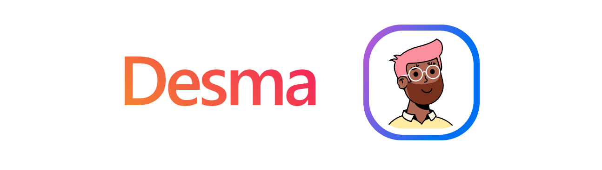
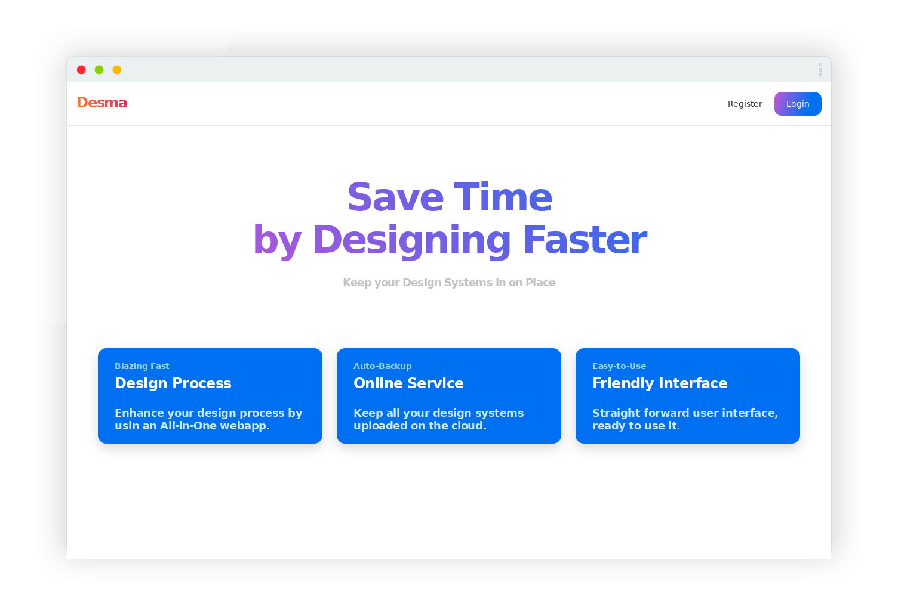
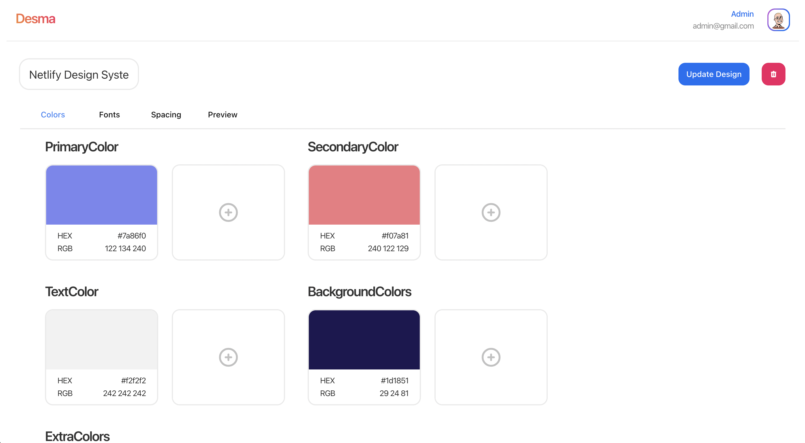
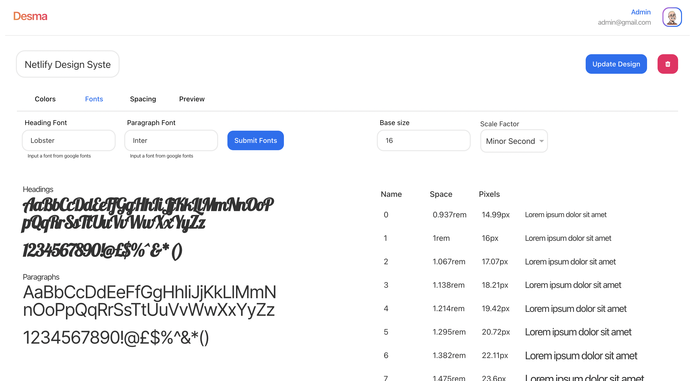
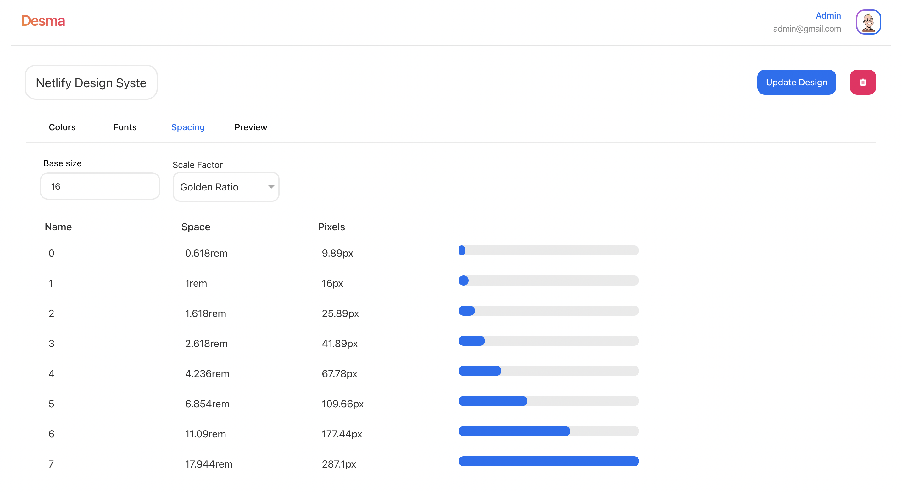

<h3 align="center">Save Time 
by Designing Faster</h3>

  

    Keep your Design Systems in one Place
     
     
    <a href="https://desma.netlify.app/">View Demo</a>
    ·
    <a href="https://github.com/Kosmos-Community/desma/issues">Report a Bug</a>
    ·
    <a href=https://github.com/Kosmos-Community/desma/issues"">Request a Feature</a>
    ·
    <a href="https://pipecruz.hashnode.dev/desma-design-hackathon-netlify">Blog</a>
  

**Desma** is a design system manager where you can create, preview and host all your designs in one single place.

### Features ✨

You can create as many design systems as you want, this is an easy to use app that let's you host all your palettes freely.

The idea of **Desma** is to save multiple features that a design can hold at once, some of them being:

-   **Color Palette** 🎨

You can save your whole color palette for primary, secondary, background, font and extra colors.

 

-   **Fonts** ⌨️

There's a space where you can input your fonts directly from google fonts to preview your headings and paragraphs. Also you can generate a font scaling palette for all your headings given a scale factor.

 

-   **Spacings** ↔️

Generate the spacing you need for your system to breathe between sections.

 

-   **Preview** 💻

One of the best things is that **Desma** has prepared a preview tab where you can watch your designs come to live and see how everything would contrast together!

 

###Future Development 👨🏽‍💻

The system is expected to scale greatly, some of the planned features for the future are:

####Social Media 

The gist of the social media is for users to share their design systems and get inspired by viewing other's people projects to create and customize one of their own.

####Team projects

Another feature is to create team projects, so a user can share their design systems with their team so everyone can join in and review the project information and add some of their own custom styles.

####Components

This is an amazing feature that could benefit designers and developers greatly, the idea is to create a section where users can create their own custom components so the design system can be more diverse, consistent and to help users better visualize how their project could end up looking like.
 

###Technologies 🔧

Some of the main technologies used in this project are:
- [Next.js](https://nextjs.org/)
- [NextUI.js](https://nextui.org/)
- [Express](https://expressjs.com/)
- [MongoDB](https://www.mongodb.com/)
- [TypeScript](https://www.typescriptlang.org/)
 

###The Team 👥
And let's not forget the development team that made it possible to build this product:
- [Pedro Cruz](https://github.com/PedroEdu6786)
- [Jorge Reyes](https://github.com/imreyesjorge)
- [Mario Chan](https://github.com/MarioJChanZurita)
- [Rafael Canto](https://github.com/RafaelCantoVazquez)
